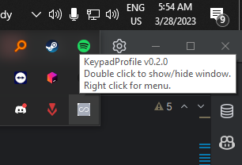

# KeypadProfile-4k
A simple Python GUI application to easily bind keys on the old 'Thnikk osu! 4k keypad'.
(https://old.thnikk.moe/models/osu.html)

 

## Building from source
Requires the following :
- Python 3 with pip installed
- pyinstaller
- 7za
- make

### Setup
- Open an elevated command prompt
- Clone the repo : `git clone https://github.com/Nylux/KeypadProfile-4k.git`
- Cd into the folder : `cd KeypadProfile-4k`
- Install requirements : `make setup`
- Build the executable : `make release`

### Alternative Setup
If for some reason you do not wish to or can not install make, you can simply open the Makefile in your 
text editor of choice and run the commands listed there in your terminal manually.
